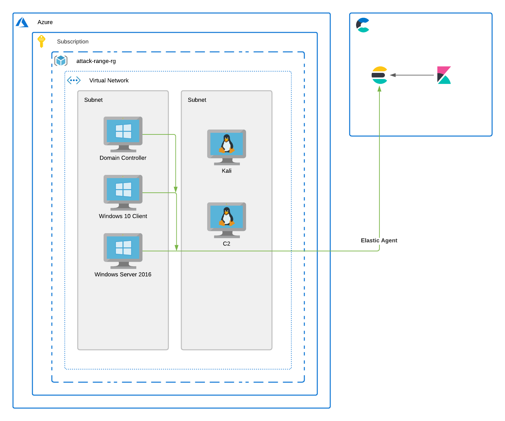
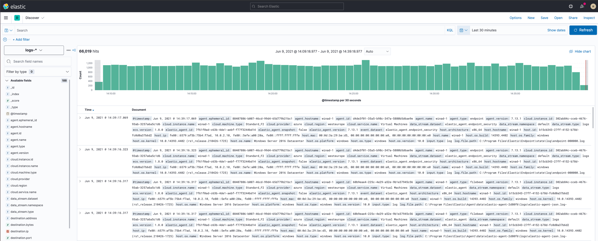
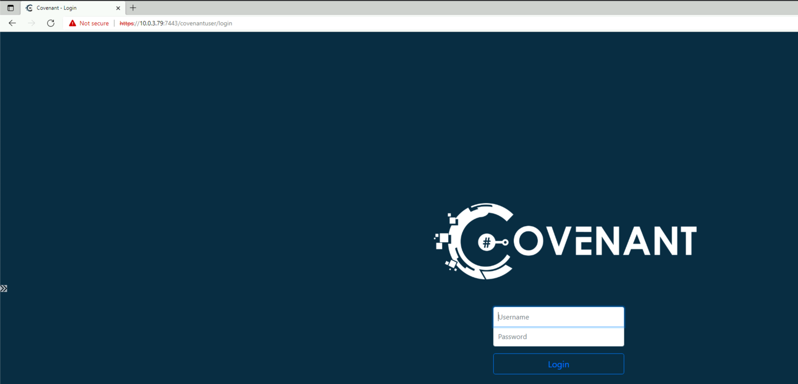

# azure-lab
A simple lab for performing adversary/threat emulation on Azure. 


## Introduction
I built this so I could easily (and relatively cheaply) spin up an environment to build CTFs, try new attacks out, and in a past life demo Elastic Security to people. 

The scripts here will deploy the following. 

- A Domain Controller
- A Windows 10 Client Machine
- A Windows Server 2016 Machine
- It will also:
  - Create a domain 
  - Join Client Machines to the domain
  - Install Elastic Agent 
- A Kali Linux machine
- An Azure Bastion host 
- A Linux Host running Covenant C2 Server

The overall architecture looks like the following: 


## Assumptions
- You have an Azure Subscription
- You have configured Terraform to work with said Azure Subscription
- To make things easier it would be good to have an elastic cloud cluster, you can get a free trial [here](https://www.elastic.co/cloud/elasticsearch-service/signup).


## Getting Started 
To get started, clone this repo. `cd` into it, and then run `ruby runner.rb` follow the prompts and away you go. A few things will happen. 
- You will be prompted to enter some text. 
- You pick if you want to plan, plan and run, or destroy your terraform environment. (This auto_approves so make sure you pick well.) 
- The script invokes terraform and will start provisioning your environnment. 

```
 ▄▄▄· ·▄▄▄▄•▄• ▄▌▄▄▄  ▄▄▄ .    ▄▄▌   ▄▄▄· ▄▄▄▄·
▐█ ▀█ ▪▀·.█▌█▪██▌▀▄ █·▀▄.▀·    ██•  ▐█ ▀█ ▐█ ▀█▪
▄█▀▀█ ▄█▀▀▀•█▌▐█▌▐▀▀▄ ▐▀▀▪▄    ██▪  ▄█▀▀█ ▐█▀▀█▄
▐█ ▪▐▌█▌▪▄█▀▐█▄█▌▐█•█▌▐█▄▄▌    ▐█▌▐▌▐█ ▪▐▌██▄▪▐█
 ▀  ▀ ·▀▀▀ • ▀▀▀ .▀  ▀ ▀▀▀     .▀▀▀  ▀  ▀ ·▀▀▀▀
Welcome to Azure Lab - please follow the prompts to get started. Happy hunting.
What do you want to call your admin user? admin-user
What do you want the admin password to be? •••••••••••••••••••••
What name do you want to use for your domain? attackrange.com
What do you want to use for the netbios domain name? attackrange
What Kibana URL do you want to use? https://dd655d45ebbc4ac7993ba79c65be59d3.fleet.eastus2.azure.elastic-cloud.com:443
What enrollment token do you wish to set for Elastic Agent to authenticate with? ••••••••••••••••••••••••••••••••••••••••••••••••••••••••••••
What do you want to do next? Plan and Run
Are you sure you want to continue on? Changes you make to the Terraform state are usually permanent. Yes
``` 
Once deployed - take a look at Kibana and you will see logs starting to come in



You will need to start covenant on the C2 Server. Just use the bastion host, and run `cd /Covenant/Covenant && dotnet run` once this has been done, Covenant will start and be accessible.


## TODO

There are a few outstanding things that need work. 

- The first is making the environment a little more vulnerable by design. Tools like [VulnAd](https://github.com/WazeHell/vulnerable-AD) will help here. 
- Add a way of doing a quick delete first off.
- Logging (The RubyTerraform Library supports this)

## Thanks 
Thanks to all the homies contributing to infosec. 
Thanks to Elastic for the Elastic Stack, it's awesome. 

